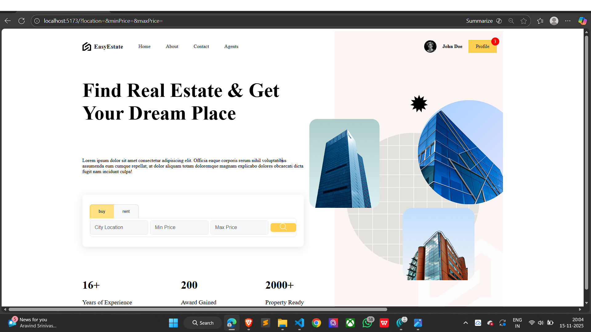
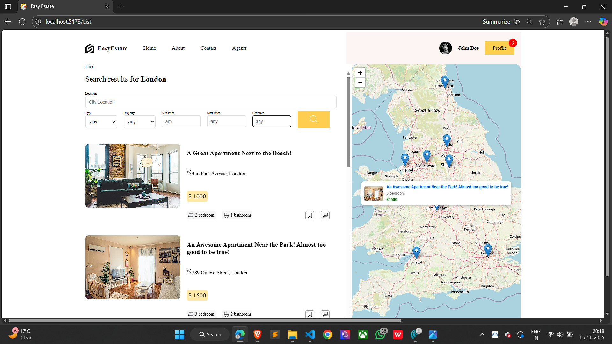
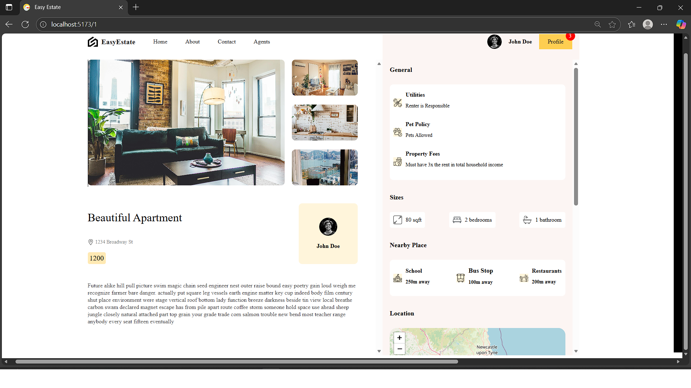
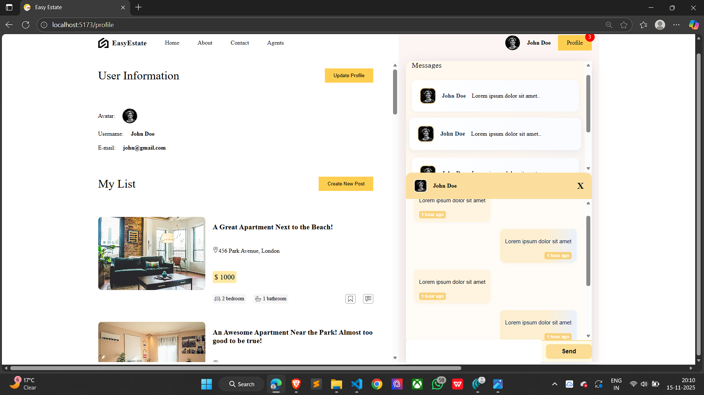

# React Real Estate UI Design
# 🏡 EstateUI – Modern Real Estate Frontend

EstateUI is a clean, modern, and responsive real-estate user interface built using **React**, **SCSS**, and **Leaflet Maps**.  
This project serves as the frontend foundation of a future full-stack real-estate platform where users can browse properties, view details, check maps, and interact with a smooth UI.

---

## 🚀 Tech Stack

- ⚛ **React.js**  
- 🎨 **SCSS (Modular Styling)**  
- 🗺️ **Leaflet.js (Map Integration)**  
- ⚡ **Vite** for fast development and optimized builds  

---

## ✨ Features

- 🏠 Modern and clean home page layout  
- 📋 Property listing page with structured card UI  
- 🎯 Filters for property search (location, price, etc.)  
- 🗺️ **Interactive Map** using Leaflet with markers  
- 📄 Detailed property page with images & features  
- 👤 Profile page UI  
- 📱 Fully responsive on all screen sizes  
- ⚡ Fast, lightweight, and easy to scale  

---

## 📸 Project Screenshots

### 🏠 **Home Page**

---

### 📋 **Listing Page**

---

### 📄 **Property Detail Page**

---

### 👤 **Profile Page**

---

## 📂 Project Structure

