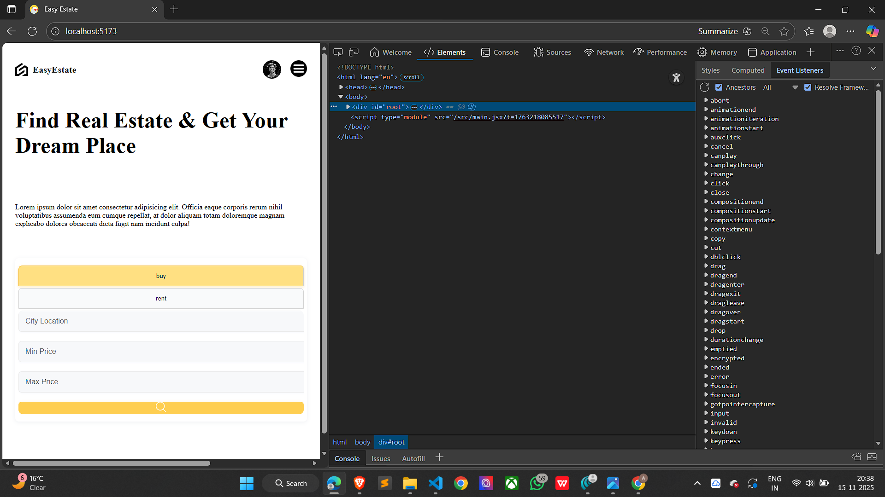
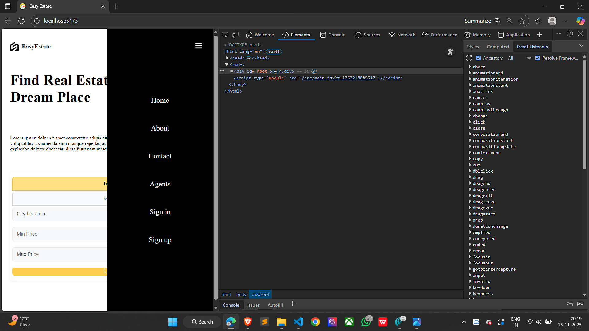
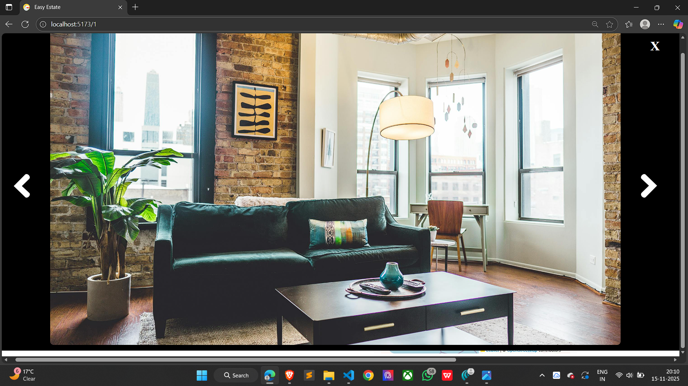

# React Real Estate UI Design
# 🏡 EstateUI – Modern Real Estate Frontend

EstateUI is a clean, modern, and responsive real-estate user interface built using **React**, **SCSS**, and **Leaflet Maps**.  
This project serves as the frontend foundation of a future full-stack real-estate platform where users can browse properties, view details, check maps, and interact with a smooth UI.

---

## 🚀 Tech Stack

- ⚛ **React.js**  
- 🎨 **SCSS (Modular Styling)**  
- 🗺️ **Leaflet.js (Map Integration)**  
- ⚡ **Vite** for fast development and optimized builds  

---

## ✨ Features

- 🏠 Modern and clean home page layout  
- 📋 Property listing page with structured card UI  
- 🎯 Filters for property search (location, price, etc.)  
- 🗺️ **Interactive Map** using Leaflet with markers  
- 📄 Detailed property page with images & features  
- 👤 Profile page UI  
- 📱 Fully responsive on all screen sizes  
- ⚡ Fast, lightweight, and easy to scale  

---
## 📸 Project Screenshots

### 🏠 Homepage

---

### 📱 Small Screen View

---

### 

---

### 📃 Listing Page

---

### 🏡 Property Detail Page

---

### 🏡 Property Slider Page

---

### 👤 Profile Page

## 📂 Project Structure

EstateUI/
│
├── assets/                     # All images & screenshots
│   ├── homepage.png
│   ├── listPage.png
│   ├── detail.png
│   ├── profilePage.png
│   ├── smallscreenview.png
│
├── public/
│   ├── index.html
│   └── ...
│
├── src/
│   ├── components/
│   │   ├── map/
│   │   ├── filter/
│   │   ├── navbar/
│   │   └── ...
│   ├── pages/
│   │   ├── home/
│   │   ├── list/
│   │   ├── detail/
│   │   ├── profile/
│   └── App.jsx
│
├── .gitignore
├── package.json
├── vite.config.js
└── README.md

🛠 Tech Stack Used

**Frontend**

⚛️ React.js

🎨 SCSS Modules

🗺 Leaflet.js (Interactive Maps)

🧭 React-Router

⚡ Vite (Build Tool)

**UI Features**

Fully responsive layout

Map with interactive markers

Property detail cards

Clean modern design with SCSS

Optimized for all screen sizes

**🚀 Getting Started**

1. Clone the Repository
git clone https://github.com/Avikal24/EstateUI.git
cd EstateUI

2. Install Dependencies
npm install

3. Start Development Server
npm run dev

4. Build for Production
npm run build

⭐ Support

If you liked this UI, drop a ⭐ on the repo:
👉 https://github.com/Avikal24/EstateUI

